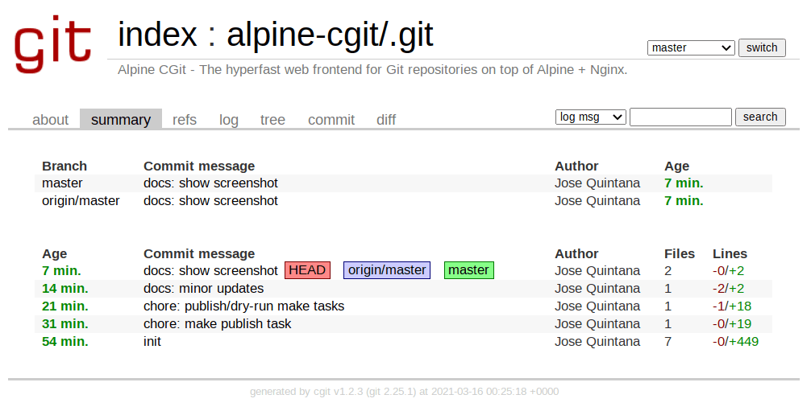

# Alpine CGit [](https://hub.docker.com/r/joseluisq/alpine-cgit/) [](https://hub.docker.com/r/joseluisq/alpine-cgit/tags) [](https://hub.docker.com/r/joseluisq/alpine-cgit/)

> The hyperfast web frontend for [Git](https://git-scm.com/) repositories on top of [Alpine](https://alpinelinux.org/) + [Nginx](https://nginx.org/).

[CGit](https://git.zx2c4.com/cgit/about/) is a web interface ([cgi](https://tools.ietf.org/html/rfc3875)) for [Git](https://git-scm.com/) repositories, written in C.



## CGit features

- Basic repository browsing (logs, diffs, trees...).
- Caching of generated HTML.
- Cloneable URLs (implements dumb HTTP transport).
- Commit feeds (atom format).
- Discovery of Git repositories.
- On-the-fly archives for tags and commits.
- Plugin support for e.g. syntax highlighting.
- Side-by-side diffs.
- Simple time/author statistics.
- Simple virtual hosting support (macro expansion).
- Understands GitWeb project-lists.
- Understands gitweb.owner in Git config files.
- Has extensive filtering framework using scripts or a built-in lua interpreter.

See [CGit project](https://git.zx2c4.com/cgit/about/) for more details.

## Usage

```sh
docker run --rm -it \
    -p 8787:80 \
    -v /my/repos/:/srv/git/ \
        joseluisq/alpine-cgit
```

**Dockerfile**

```Dockerfile
FROM joseluisq/alpine-cgit
```

## Volumes

- `/srv/git`: Place for Git repositories.
- `/var/cache/cgit`: CGit caching of generated HTML.

## Settings via env variables

- `CGIT_TITLE`: Website title.
- `CGIT_DESC`: Website description.
- `CGIT_VROOT`: Virtual root directory.
- `CGIT_SECTION_FROM_STARTPATH`: How many path elements from each repo path to use as a default section name.
- `CGIT_MAX_REPO_COUNT`: Number of entries to list per page on the repository index page.

See default file configuration at [cgit/cgit.conf](./cgit/cgit.conf)

## Contributions

Unless you explicitly state otherwise, any contribution intentionally submitted for inclusion in current work by you, as defined in the Apache-2.0 license, shall be dual licensed as described below, without any additional terms or conditions.

Feel free to send some [Pull request](https://github.com/joseluisq/alpine-cgit/pulls) or [issue](https://github.com/joseluisq/alpine-cgit/issues).

## License

This work is primarily distributed under the terms of both the [MIT license](LICENSE-MIT) and the [Apache License (Version 2.0)](LICENSE-APACHE).

© 2021-present [Jose Quintana](https://git.io/joseluisq)
